### <code>The Cipher Stack</code>

<table>
<tr>
<td></td>
<td></td>
</tr>
</table>

---

### <code>Contributions</code>

---

### <code>Featured Project</code>

 
<b>S</b> — <a href="https://github.com/SKRT7-0day/S">github.com/SKRT7-0day/S</a>

---

### <code>Tech Arsenal</code>

**Frontend**
 

**Backend / Cloud**
 

**Tools / DevOps**
 

---

### <code>What I'm Up To</code>

| Currently Building | Learning | Fun Fact |
|---|---|---|
| Discord tooling & bots on Cloudflare Workers | Deepening backend architecture on the edge | Runs a Discord server community alongside coding |

---

### <code>Achievements</code>

---

### <code>Socials</code>

  

